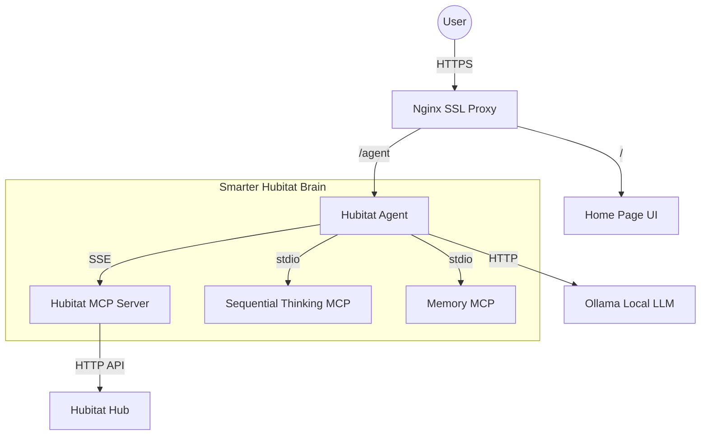

# Agent Architecture Documentation

This document describes the AI agent constructs in the home automation system.

## Overview

The system consists of multiple AI agents and specialized MCP servers that provide smart home automation, reasoning, and memory capabilities.

### Communication Protocols
- **A2A (Agent-to-Agent)**: For inter-agent communication and coordinated planning.
- **MCP (Model Context Protocol)**: For exposing specific tools (Hubitat, Reasoning, Memory) to agents.

## Architecture Diagram

## Specialized Agents

### Hubitat Agent (`src/agents/hubitat_a2a.py`)

**Type**: Specialized A2A Server Agent

**Purpose**: Acts as the primary interface for smart home control, planning, and long-term memory.

**Key Features**:
- **Multi-MCP Aggregation**: Combines tools from three sources into a single "smarter" brain.
- **Device Control**: Comprehensive management of Hubitat devices via [hubitat-mcp](https://github.com/coatsnmore/hubitat-mcp).
- **Advanced Reasoning**: Uses the Sequential Thinking MCP for complex multi-step automation.
- **Persistent State**: Leverages the Memory MCP to recall user habits and preferences.

**Tools Implemented**:
*   `list_devices`, `device_details`, `control_device` (Hubitat)
*   `sequential_thinking` (Reasoning)
*   `memory` / `knowledge_graph` (Persistence)

**Network Configuration**:
- **Internal Port**: `9002`
- **External Path**: `/agent` (via Nginx)
- **A2A URL**: `https://${HOST_URL}/agent`

---

### Home Agent (`src/agents/home_a2a.py`)

**Type**: Coordinator Agent

**Purpose**: acts as a central discovery hub for various specialized agents (Lighting, Security, HVAC) and delegates tasks accordingly.

**Configuration**:
- **Internal Port**: `9001`
- **Known Connections**: Delegates to Hubitat Agent at `http://hubitat-agent:9002`.

---
