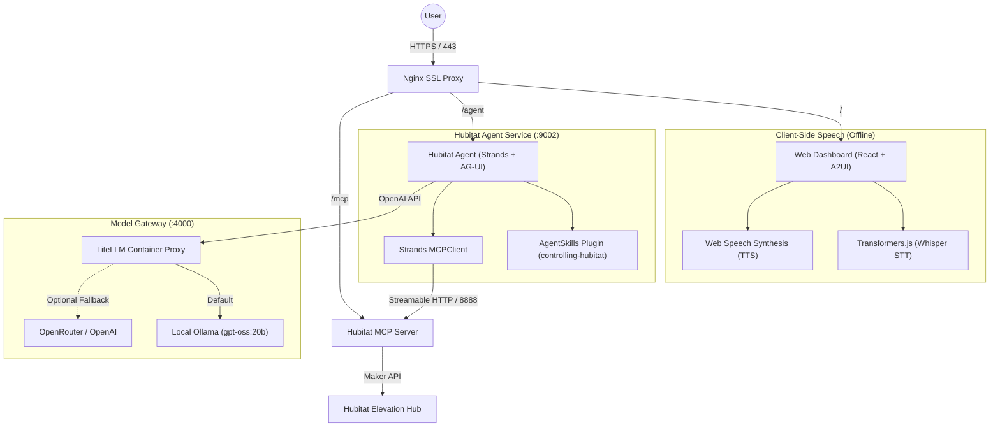

# Agent Architecture Documentation

This document describes the modern architecture of the Home Agent system.

## Overview

The system is built on **Strands Agents (v1.55.1+)**, **AG-UI (Agent-User Interaction Protocol)**, **A2UI (Generative UI)**, and **LiteLLM**.

It connects a browser-first interactive React dashboard directly to a specialized Hubitat smart home agent using real-time SSE streaming. Model routing is decoupled through a containerized LiteLLM gateway defaulting to local Ollama.



---

## Key Architectural Components

### 1. Hubitat Agent (`services/agent/src/hubitat_agent.py`)
* **Framework**: Strands Agents SDK `v1.55.1`.
* **Protocol**: **AG-UI Protocol** (`ag-ui-strands`, `ag-ui-protocol`) over Server-Sent Events (SSE). Replaces A2A for client-to-agent communication.
* **Skills Integration**: Dynamically loads `skills/controlling-hubitat` using the native `AgentSkills` plugin. The agent follows the mandatory 4-step pre-flight sequence (`list_devices` -> `device_details` -> `device_capabilities` -> `control_device`).
* **Tool Access**:
  - **Hubitat Maker API**: Integrates directly with `hubitat-mcp` for device discovery and control without hardcoded IDs.
  - **DuckDuckGo Web Search**: Containerized `duckduckgo-mcp` on port `7070` providing live web queries and article fetching.
  - **Outdoor Weather Tool**: Built-in Open-Meteo tool (`weather_tool.py`) that returns current temperature, feels-like, highs/lows, humidity, and wind in Fahrenheit, inferring location from the web client's detected coordinates.
* **Clean System Prompt**: Tailored for smart home automation, internet intelligence, and markdown table presentation with spoken summary headers for TTS.

### 2. Model Routing via LiteLLM (`docker/litellm_config.yaml`)
* Runs as a lightweight container (`ghcr.io/berriai/litellm:main-latest`) on port `4000`.
* Default model mapped to `ollama/gpt-oss:20b` running on the host machine (`http://host.docker.internal:11434`).
* Allows swapping or adding cloud models (OpenRouter, OpenAI, Claude) without modifying any agent code.

### 3. Web Dashboard (`services/web`)
* **Framework**: React 19 + Vite.
* **Theme**: Modern dark mode with responsive grid, glassmorphic cards, and glowing telemetry indicators.
* **AG-UI Client**: Streams agent reasoning deltas, tool execution badges, and device state updates.
* **A2UI Interactive Cards**: Interactive device widgets (on/off toggles, brightness sliders, sensor badges) that allow direct user control or automated agent control.
* **Offline Speech-to-Text (STT)**: In-browser Whisper transcription with energy-based Voice Activity Detection (VAD).
* **Offline Text-to-Speech (TTS)**: Browser-native `SpeechSynthesis` with English voice prioritization and barge-in cancellation.

### 4. Repository Structure

```text
home-agent/
├── docker/
│   ├── docker-compose.yml        # Unified service orchestrator
│   ├── litellm_config.yaml       # LiteLLM routing matrix
│   ├── agent.Dockerfile          # Fast Python/uv container for Agent
│   ├── web.Dockerfile            # Node container for React frontend
│   └── nginx/                    # SSL reverse proxy
├── services/
│   ├── agent/                    # Hubitat Strands Agent (FastAPI + AG-UI)
│   │   ├── pyproject.toml
│   │   └── src/
│   │       ├── main.py           # AG-UI FastAPI server entrypoint
│   │       └── hubitat_agent.py  # Agent and skills definition
│   └── web/                      # React 19 Web Dashboard
│       ├── package.json
│       ├── vite.config.js
│       └── src/
│           ├── components/       # DeviceCard, ChatStream, VoiceHUD, Header
│           ├── hooks/            # useAguiChat, useSTT, useTTS
│           └── styles/           # Design tokens and glassmorphism styling
├── skills/
│   └── controlling-hubitat/      # SKILL.md rules for Hubitat Elevation
├── AGENTS.md                     # Architecture documentation
├── pyproject.toml                # Root dependencies
└── .env.example                  # Environment configuration template
```

---

## Engineering & Workflow Guidelines

### Fix-Forward Philosophy
* **Prefer Fix-Forward**: When encountering errors, build mismatches, or unexpected behaviors, always prefer fixing forward rather than rolling back, discarding working tree modifications, or checking out previous commits/versions (`git checkout`, `git restore`).
* **Preserve Working State**: Never revert or discard unstaged code changes or generated artifacts unless the user explicitly requests a rollback. Investigate issues in place and advance the system state with forward-moving solutions.